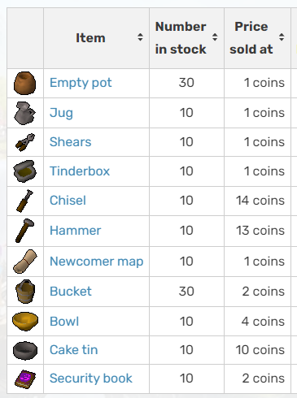

[Grįžti į pradžią](../../README.md)

# Užduotis: 1

1. Susikuriame naują failą pavadinimu `shop.js`
2. Susikuriame naują script'ą `"shop": "node ./shop.js"`
3. Atsidarome puslapį https://runescape.fandom.com/wiki/Varrock_General_Store
4. Žemiau yra lentelė su prekių kainomis
   
5. Kiekvienai prekei reikia sukurti kintamuosius, su jų kainomis ir iš karto juos išspausdinti, pvz.:

```js
const emptyPot = 1;
console.log(emptyPot);

const jug = 1;
console.log(jug);
```

6. Atkreipkime dėmesį kaip yra rašomi kintamųjų pavadinimai:
    - tik angliškos raidės
    - visos raidės yra mažosios
    - nebent yra keli žodžiai, tada sekantys žodžiai prasideda iš didžiosios raidės
7. Pabaik rašyti visų likusių prekių kintamuosius ir juos išspausdink
