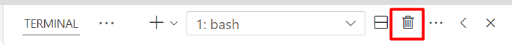

[Grįžti į pradžią](../../README.md)

# Editoriaus pasiruošimas

1. Susirasti ir pasileisti "Visual Studio Code"
2. Atidaryti terminalą `` Ctrl + `  ``
    - `` ` `` (backtick) mygtuką galima rasti žemiau `Esc` mygtuko (antro eilė, pirmas mygtukas)
    - jei spausti `` Ctrl + `  `` daugiau kartų, tai terminalas atsidaro ir užsidaro
3. Norint visiškai uždaryti terminalą, visų pirma jis turi būti atidarytas ir viršutiniame dešiniajame kampe turėtų matyti šiukšlių dėžės ikonėlė - paspausk ją
    - šitą reikėtų padaryti kiekvieną kartą kai baigi darbą
      
