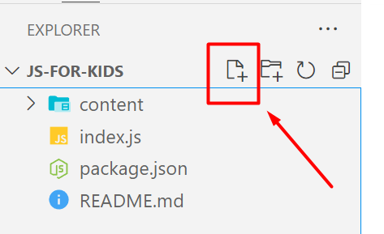

[Grįžti į pradžią](../../README.md)

# JavaScript projekto pradžia

1. Susikuriame naują failą, pavadinimu `index.js`
   
2. Į šį failą parašome:

```js
console.log('Labas rytas suraitytas');
```

3. Išsaugome failą
4. `package.json` faile sukuriame naują script'ą, kuris paleidinės mūsų naują JavaScript kodą:

```json
"scripts": {
    "kodas": "node ./index.js",
    "test": "echo \"Error: no test specified\" && exit 1"
},
```

5. Išbandome script'ą ir pažiūrime, jog gauname reikiamą rezultatą:

```
$ npm run kodas

> js-for-kids@1.0.0 kodas
> node ./index.js

Labas rytas suraitytas
```
