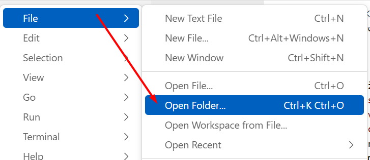
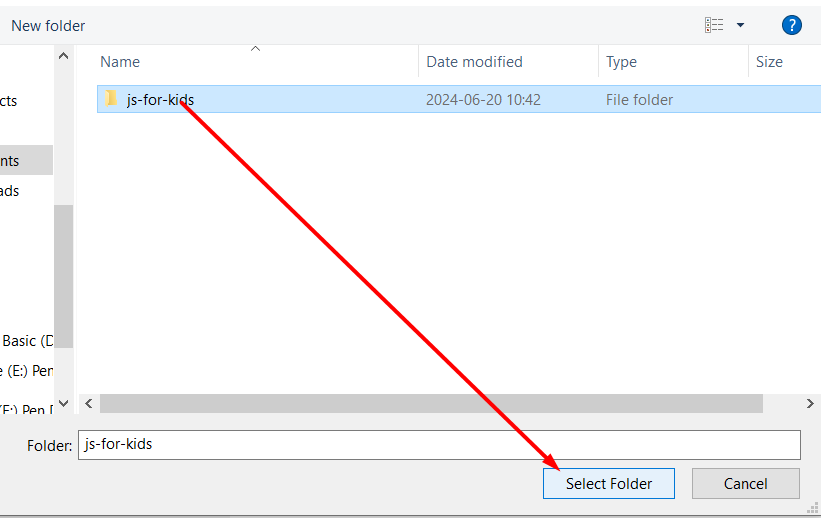

[Grįžti į pradžią](../../README.md)

# Naujo projekto pasiruošimas

Norint pradėti dirbti su bet kokio nauju projektu, reikia kaskart šiuo veiksmus:

1. Susikurti naują `folder'į` sugalvojant jam naują pavadinimą
    1. Galima vieta: `Documents` folder'is
    2. Pavadinimų rašymo taisyklės:
        - tik mažosios raidės
        - tik angliškos raidės
        - jei pavadinimas sudaromas iš keletos žodžių - sujungti juos minuso ženklo
    3. Galimi pavadinimų pavyzdžiai:
        - jei iš vieno žodžio, pvz.:
            - `pomidoras`
            - `skanumynas`
            - `bandymas`
        - jei iš keletos žodžių, pvz.:
            - `mano-projektas`
            - `mano-batai-buvo-du`
            - `mokausi-javascript`
2. Tada tą sukurtą folder'į reikia atsidaryti su "Visual Studio Code"
    - viršuje dešinėje turi matytis "File"
    - tada pasirenkame "Open Folder"
    - tada susirandame norimą folder'į ir **vieną kartą** paspaudžiame ant jo pavadinimo
    - paspaudžiame mygtuką "Select Folder"
3. Įsitikimane, jog viskas teisingas atlika
    - "Visual Studio Code" pačiame viršuje per vidurį turėtume matyti pasirinkto folder'io pavadinimą
    - jei pavadinimo matosi - viskas gerai
    - jei pavadinimo nesimato - kažkas negerai

